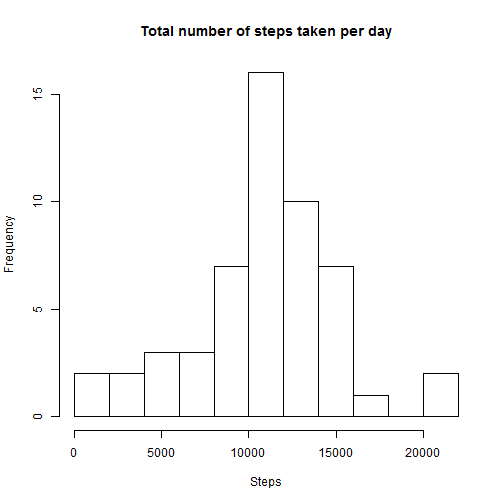
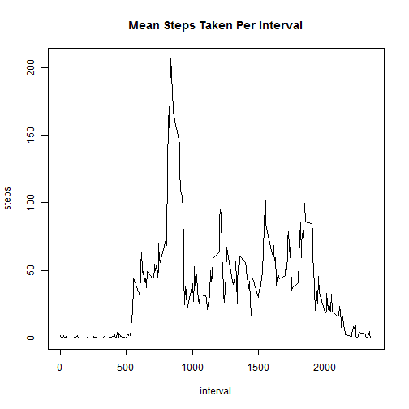
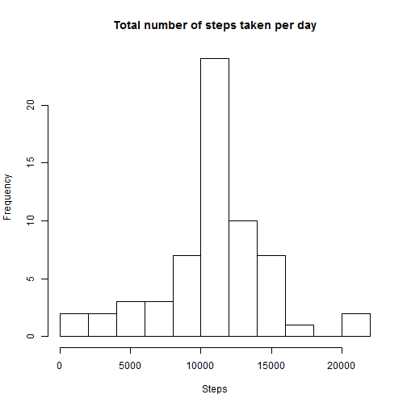
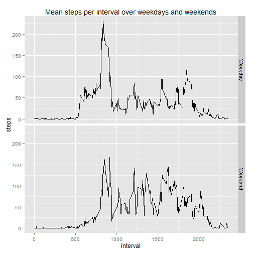

#ACTIVITY MONITORING

This assignment makes use of data from a personal activity monitoring device. This device collects data at 5 minute intervals through out the day. The data consists of two months of data from an anonymous individual collected during the months of October and November, 2012 and include the number of steps taken in 5 minute intervals each day.

Load required libraries for analysis and plotting

```r
library(plyr)
library(ggplot2)
```

##Loading and Preprocessing the data

```r
data <- read.csv("activity.csv")
data$date <- as.Date(data$date)
```

##What is the mean total number of steps taken per day ?
- Make a histogram of the total number of steps taken each day

```r
stepsPerDay <- ddply(data, .(date), summarize, steps=sum(steps))

hist(stepsPerDay$steps, main="Total number of steps taken per day", xlab="Steps", breaks=10)
```

 

- Calculate and report the mean and median total number of steps taken per day

```r
mean(stepsPerDay$steps, na.rm=TRUE)
```

```
## [1] 10766.19
```

```r
median(stepsPerDay$steps, na.rm=TRUE)
```

```
## [1] 10765
```

##What is the average daily activity pattern?

- Make a time series plot (i.e. type = "l") of the 5-minute interval (x-axis) and the average number of steps taken, averaged across all days (y-axis)

```r
stepsPerInterval <- ddply(data, .(interval), summarize, steps=mean(steps, na.rm=TRUE))
with(stepsPerInterval, plot(interval, steps, type="l"))
```

 

- Which 5-minute interval, on average across all the days in the dataset, contains the maximum number of steps?

```r
maxIntervalIndex <- which(stepsPerInterval$steps == max(stepsPerInterval$steps))
intervalWithMaxSteps <- stepsPerInterval[maxIntervalIndex,1]
```

##Imputing missing values

- Calculate and report the total number of missing values in the dataset (i.e. the total number of rows with NAs)

```r
sum(is.na(data))
```

```
## [1] 2304
```

- Devise a strategy for filling in all of the missing values in the dataset.Create a new dataset that is equal to the original dataset but with the missing data filled in.
I am using the mean for the particular 5 minute interval to fill in the missing values

```r
filledData <- data
missingRowIndexes <- which(is.na(data))
for(i in 1:length(missingRowIndexes))
{
  index <- missingRowIndexes[i]
  filledData[index,]$steps <- stepsPerInterval[stepsPerInterval$interval==data[index,3], 2]
}
```

- Make a histogram of the total number of steps taken each day and Calculate and report the mean and median total number of steps taken per day. Do these values differ from the estimates from the first part of the assignment? What is the impact of imputing missing data on the estimates of the total daily number of steps?

```r
filledDataStepsPerDay <- ddply(filledData, .(date), summarize, steps=sum(steps))
hist(filledDataStepsPerDay$steps, main="Total number of steps taken per day", xlab="Steps", breaks=10)
```

 

```r
mean(filledDataStepsPerDay$steps)
```

```
## [1] 10766.19
```

```r
median(filledDataStepsPerDay$steps)
```

```
## [1] 10766.19
```
After imputing missing data, we get equal mean and median for the total daily number of steps.
The mean did not change from the original dataset mean. The median changed very slightly, it increased by ~1 after imputing missing values

##Are there differences in activity patterns between weekdays and weekends?

- Create a new factor variable in the dataset with two levels -- "weekday" and "weekend" indicating whether a given date is a weekday or weekend day.

```r
filledData$weekdayOrWeekend="Weekday"
for(rowIndex in 1:nrow(filledData))
{
  if(weekdays(filledData[rowIndex,]$date) == "Sunday" | weekdays(filledData[rowIndex,]$date) == "Saturday")
    filledData[rowIndex,]$weekdayOrWeekend = "Weekend"
}
filledData$weekdayOrWeekend <- as.factor(filledData$weekdayOrWeekend)
```

- Make a panel plot containing a time series plot (i.e. type = "l") of the 5-minute interval (x-axis) and the average number of steps taken, averaged across all weekday days or weekend days (y-axis). 


```r
stepsPerIntervalFilledData <- ddply(filledData, .(interval, weekdayOrWeekend), summarize, steps=mean(steps))

g <- ggplot(stepsPerIntervalFilledData, aes(x=interval, y=steps))
g + geom_line() + facet_grid(weekdayOrWeekend~.)
```

 

